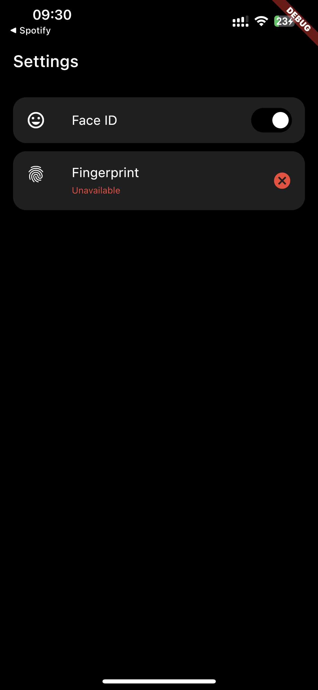

# flutter_local_authentication

This is an example that shows how to use local authentication (FaceID and Fingerprint) on **Android** and **iOS** devices

For this example was used **mobx** to manage the state of the application, **sharedPreferences** to memorize the settings made by the user.

## Getting Started

 

 